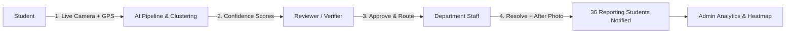

# SmartCampus — AI-Powered, Evidence-Backed Campus Incident Platform

> **"Traditional complaint systems treat every submission as an independent ticket. SmartCampus transforms individual student reports into verified, clustered, and prioritized campus incidents automatically routed to the right university department."**

---

## 🌟 The Core Differentiator

| Traditional Campus Portals | SmartCampus AI Platform |
|---|---|
| ❌ 36 students submit 36 duplicate tickets for Wi-Fi in Block A | ✅ Vector Embeddings detect semantic similarity & cluster into **1 Master Incident (#INC-284)** |
| ❌ Gallery photo uploads allow old or fabricated photos | ✅ **Strict Live Camera Capture** with timestamp watermark & GPS lock |
| ❌ Manual admin triage causes multi-day delays | ✅ **AI Vision + Multimodal Verification** (0-100% confidence match) & auto-routing |
| ❌ No accountability or closure proof | ✅ **Before ↔ After Resolution Evidence** side-by-side inspection |
| ❌ No geographic spatial intelligence | ✅ **Campus Incident Heatmap** identifying chronic infrastructure hotspots |

---

## 🏛️ Four-Role RBAC Workflow



1. **Student (`STUDENT`)**:
   - Live camera capture (no gallery upload).
   - Real-time GPS geofencing against university polygons.
   - Status tracking & notifications when reports merge into campus incidents.
2. **Reviewer (`REVIEWER`)**:
   - Inspects AI Vision match confidence %, detected assets, and duplicate similarity.
   - Approves, Rejects, Merges into existing incidents, or edits department routing.
   - Design Principle: *"AI recommends. Humans verify. Backend enforces."*
3. **Department Staff (`STAFF`)**:
   - Department-scoped queue (e.g. IT staff only sees IT network/projector tickets).
   - Lifecycle: `REPORTED` $\rightarrow$ `ACCEPTED` $\rightarrow$ `IN_PROGRESS` $\rightarrow$ `RESOLVED`.
   - Attaches resolution notes and **After-Resolution Evidence photo**.
4. **Admin / Dean (`ADMIN`)**:
   - Real-time Executive KPI dashboard (Clustering efficiency %, SLA resolution benchmarks).
   - Interactive spatial campus heatmap by block.
   - Immutable chronological system audit trail.

---

## 🛠️ Technology Stack

- **Frontend**: React (Vite) + Tailwind CSS + Lucide Icons + Leaflet Spatial Maps + Socket.IO Client + Canvas Confetti
- **Backend**: Node.js + Express.js + Socket.IO + Multer + Helmet + Morgan + Cookie-Parser + JWT
- **AI & Vision**: Multimodal Vision + LLM Structured Classification + Semantic Vector Embeddings (Gemini API with built-in zero-config offline fallback)
- **Database**: MongoDB (Mongoose) + Vector Cosine Similarity Search + In-Memory Fallback
- **Security & Validation**: HTTP-only JWT Cookies + RBAC + Zod Schema Validation + Immutable Audit Logs
- **API Docs**: Interactive OpenAPI / Swagger UI at `/api/docs`

---

## 🚀 Getting Started

### 1. Prerequisites
- Node.js $\ge 18$
- npm $\ge 9$

### 2. Start the Backend API Server
```bash
cd backend
npm install
npm run seed     # Seeds campus zones, departments, demo users, clustered incidents
npm start        # Starts Express + Socket.IO on http://localhost:5000
```
- Interactive Swagger API Documentation: `http://localhost:5000/api/docs`

### 3. Start the React Frontend Application
```bash
cd frontend
npm install
npm run dev      # Starts Vite dev server on http://localhost:5173
```

---

## 🔑 Demo Login Credentials

> SmartCampus features a **1-Click Demo Profile Switcher** on the login page and top navbar for instant presentations!

| Role | Email | Password | Assigned Department |
|---|---|---|---|
| **Student** | `student@smartcampus.edu` | `password123` | N/A |
| **Student 2** | `student2@smartcampus.edu` | `password123` | N/A |
| **Reviewer** | `reviewer@smartcampus.edu` | `password123` | University Verifier |
| **IT Staff** | `staff.it@smartcampus.edu` | `password123` | Information Technology |
| **Electrical Staff**| `staff.elec@smartcampus.edu` | `password123` | Electrical Maintenance |
| **Maintenance Staff**| `staff.maint@smartcampus.edu`| `password123` | Civil Works & Plumbing |
| **Dean / Admin** | `admin@smartcampus.edu` | `password123` | Executive Administration |

---

## 🧪 Automated End-to-End Test Suite

Run the full automated test suite (19 passing assertions verifying RBAC, Geofencing, AI analysis, duplicate clustering, reviewer routing, staff resolution, and analytics):

```bash
cd backend
npm test
```

## 📚 Kalvium Concept Demonstrations

This repository intentionally demonstrates the following concepts:

| Concept | Location |
|---|---|
| LLM API Integration | `backend/src/services/aiService.js` |
| Prompt Engineering | `backend/src/services/aiService.js` |
| Structured Outputs | `backend/src/services/aiService.js` |
| Middleware | `backend/src/middlewares/` |
| JavaScript Event Loop | `backend/src/js-concepts/eventLoop.js` |
| JavaScript Hoisting | `backend/src/js-concepts/hoisting.js` |
| Promises vs Callbacks | `backend/src/js-concepts/promises-vs-callbacks.js` |
| MongoDB CRUD | `backend/src/controllers/` + `backend/src/models/` |
| MongoDB Schema Modeling | `backend/src/models/` |
| Relational PK/FK Design | `backend/sql/schema.sql` |
| SQL JOINs | `backend/sql/joins.sql` |
| Git Workflow | Git branches, commits and pull requests used during development |

### JavaScript concept demos

Run these from the `backend` directory:

```bash
node src/js-concepts/eventLoop.js
node src/js-concepts/hoisting.js
node src/js-concepts/promises-vs-callbacks.js
```
